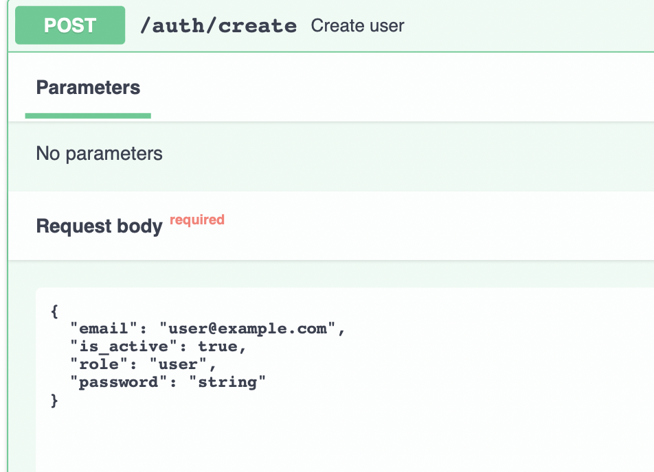
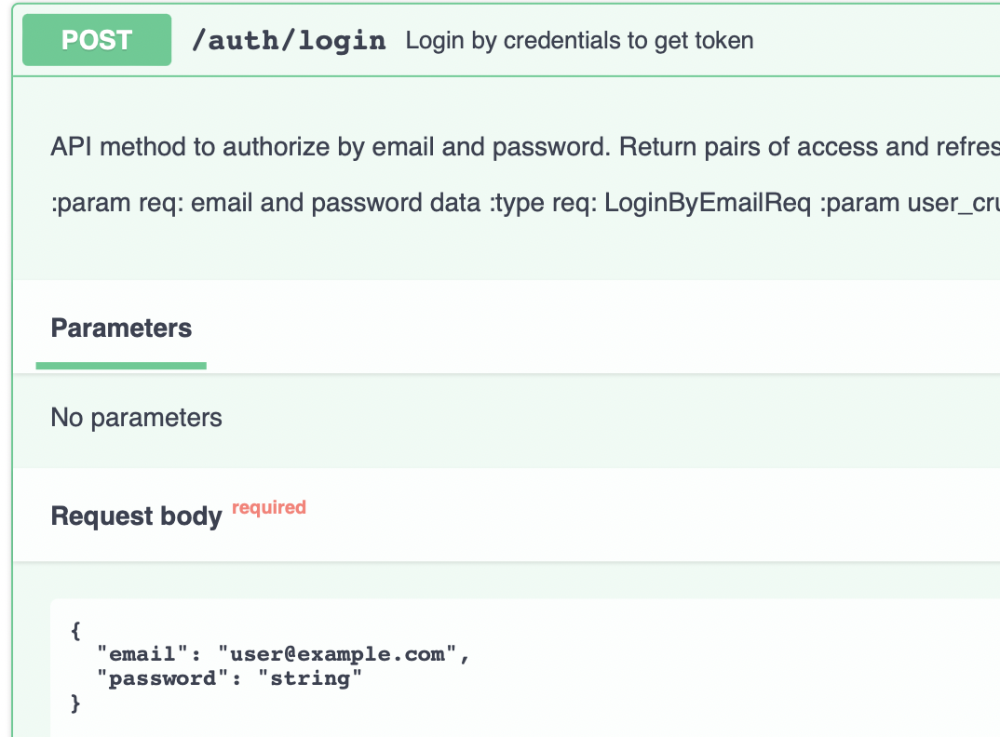
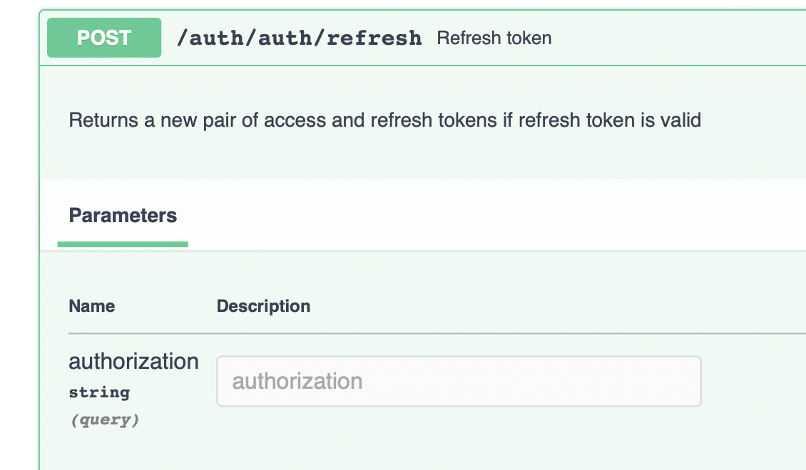
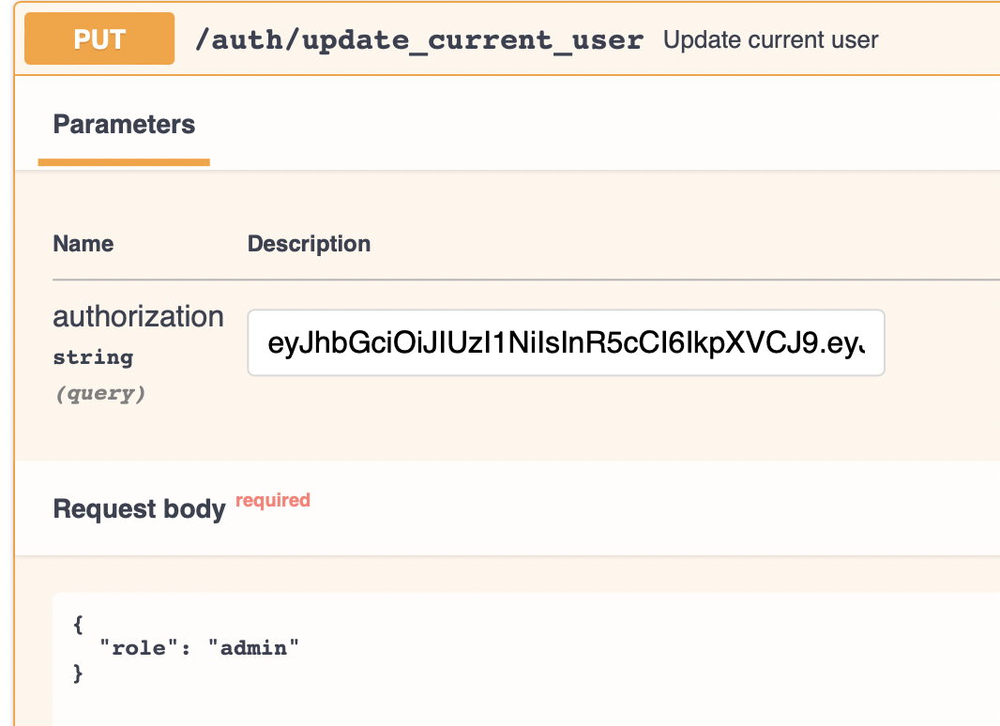
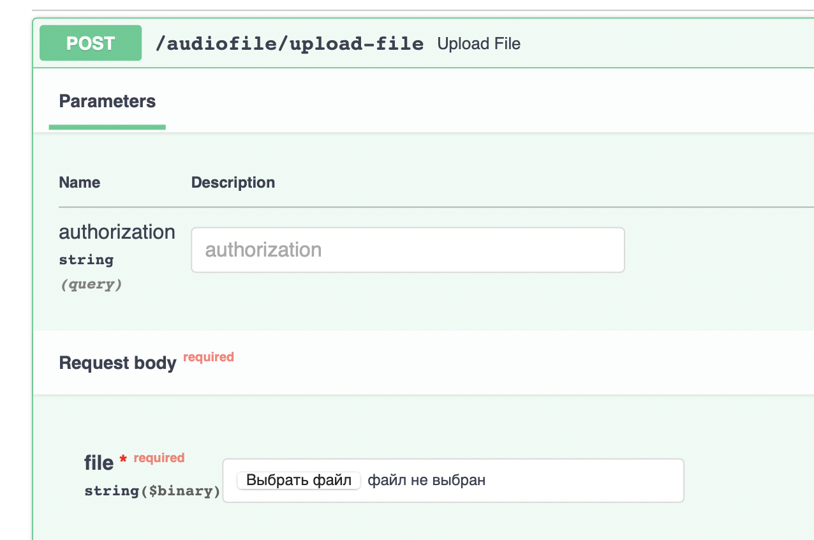
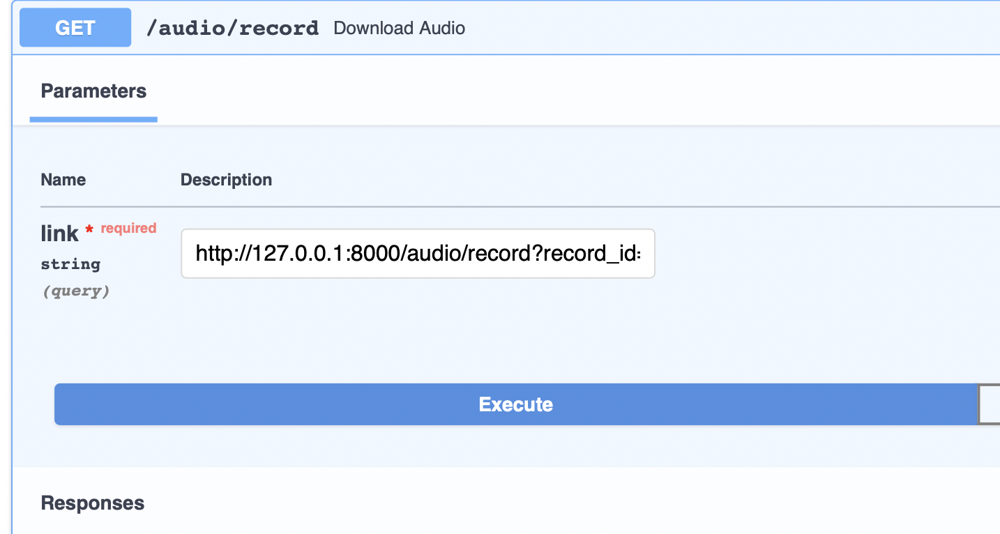
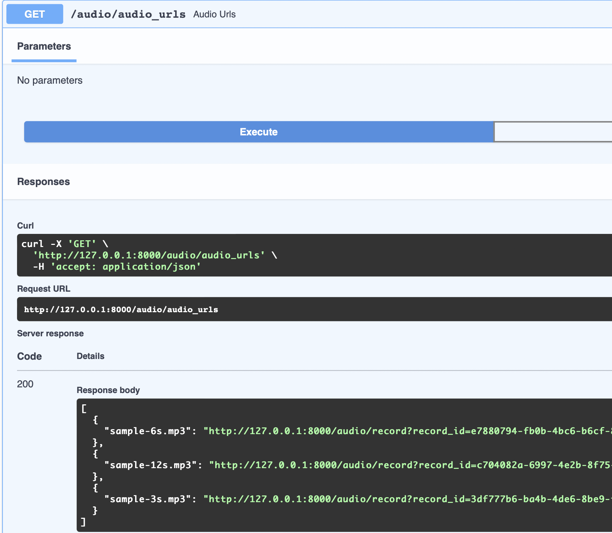
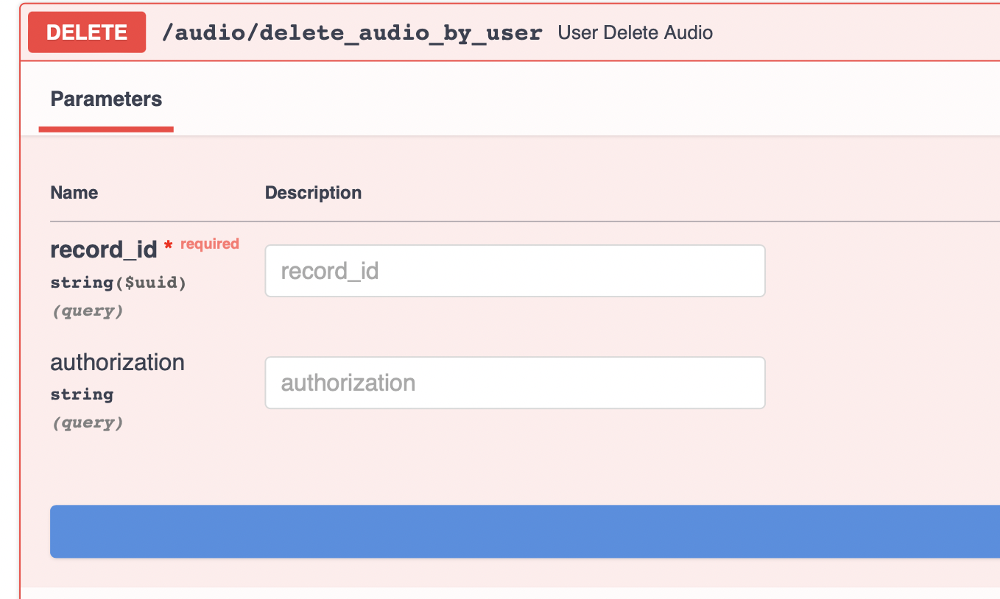
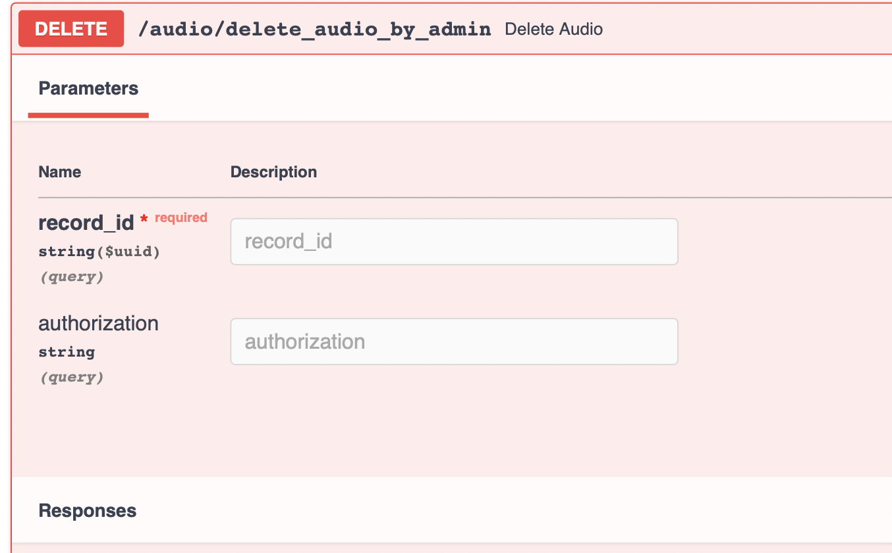

    
    
    
    
    
    

## Клонируем репозиторий:

    git clone https://github.com/Mitsufiro/bewise_second

## Развертывание

`docker-compose up`

## Migrations

При изменении модели данных необходимо создать миграцию

`docker exec app alembic revision --autogenerate -m "New Migration"`

Для применения изменений, необходимо запустить

`docker exec app alembic upgrade head`

* Создание юзера.

 

* При входе заполняем данные пользователя и просто берем access token, который нам необходим для использования методов. Уникальный идентификатор пользователя вшит в токен.

 

* Далее в зависиммости от прав юзера можем использовать методы.

* Обновление токена

 

* Обновление данных юзера (Оставляем только те поля, которые нам нужны)

 

* Загрузка файла (При загрузке создается личная папка юзера, файл конвертируется в формат mp3 и данне сохраняются в БД)

 

* Скачивание файла (Подаем ссылку)

 

* Можем посмотреть какие файлы можно скачать

 

* Удаление юзером собственных файлов
 
 

* Удаление админом любых файлов
 
 

## Finally:

• Реализован ролевой доступ к API-методам в зависимости от уровня прав пользователя.

• Настроена валидация данных.

• Swagger.

• Подготовлен docker-контейнер с сервисами.

• Универсальный CRUD.

• Реализация асинхронных методов.

• Настроено опциональное изменение данных пользователей (Чтобы изменить нужное поле необходимо оставить только его).

• Настроена аутентификация (Доступ к методам производится путем подачи токена со стороны пользователя).

• Код отредактирован (black, isort).

